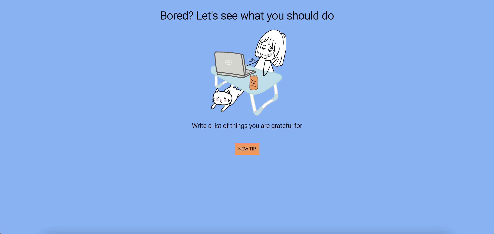

# Boredom Buster Tips 🎉

Welcome to the **Boredom Buster Tips** repository! This React app is designed to rescue you from boredom by providing a simple and delightful user interface for fetching tips on what to do when you're feeling bored. With just a click of a button, you'll be presented with creative suggestions to turn your dull moments into exciting adventures.

## Demo

Check out the live demo of the app: [Boredom Buster Tips Demo](https://64ed015f6c0f72074f205c23--statuesque-horse-4abdee.netlify.app/)

## Features

- **User-Friendly Interface:** This app offers a user-friendly interface with a single button to generate new tips instantly.

- **Simple and Elegant Design:** The UI is designed to be minimalistic and easy on the eyes, ensuring a smooth and enjoyable user experience.

- **API Integration:** I've integrated an API that provides a curated collection of interesting activities to keep you entertained.

- **One-Click Solution:** Combat boredom with a single click! Click the "New tip" button, and a new tip will appear magically.
- 
## How to Use

1. Visit the [Boredom Buster Tips Demo](https://64ed015f6c0f72074f205c23--statuesque-horse-4abdee.netlify.app/) website.
2. Click the "Get Tip" button.
3. A new tip for beating boredom will appear on the screen.
4. Click the button again for even more creative suggestions!

